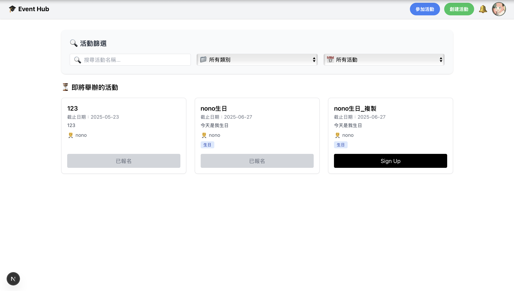

# Event Hub

Event Hub is a full-stack event management platform built with **Next.js** and **Supabase**, designed for student clubs and organizers to easily create, manage, and collect registrations for events.



## 🚀 Features

* 🧾 **Dynamic Event Creation**: Organizers can create events with custom registration form schemas
* 🧑‍💼 **Role-based Access**: Distinguish between event creators, co-organizers, and attendees
* 📝 **Custom Forms**: Dynamic personal and custom fields for participants to fill
* 🔐 **Auth & Profile**: Sign up, sign in, and manage user profile
* 🔔 **Notification Bell**: Participants get real-time reminders about upcoming deadlines
* 📊 **Registration Management**: View and manage participant submissions
* 🌗 **Dark Mode** support

## 🧱 Tech Stack

* **Frontend**: [Next.js 13](https://nextjs.org/), Tailwind CSS, App Router
* **Backend**: [Supabase](https://supabase.io/) (Auth, Database)
* **CI/CD**: GitHub Actions + Vercel

## 🧑‍💻 Local Development

```bash
# Clone the project
git clone https://github.com/nonoivan1234/event-management.git
cd event-management/event-hub

# Install dependencies
npm install

# Setup environment variables
cp .env.example .env.local
# Fill in the required Supabase keys

# Run the app
npm run dev
```

Visit [http://localhost:3000](http://localhost:3000)

## 📁 Project Structure

```
event-hub/
├── src/
│   ├── app/           # App Router pages
│   ├── components/    # UI Components
│   ├── lib/           # Supabase client setup
├── .github/workflows/ # GitHub Actions CI
├── public/
├── .env.local         # Environment config
├── next.config.js
├── tailwind.config.js
└── package.json
```

## 🧪 CI/CD

* Lint and build checks on pull requests via GitHub Actions
* Automatic deployment to [Vercel](https://vercel.com/) on `main` branch pushes

## 🙌 Acknowledgements

* [ShadCN/UI](https://ui.shadcn.dev/)
* [Supabase](https://supabase.com/)
* [Next.js](https://nextjs.org/)

## Contributing
If you have any issues or suggestions, feel free email me at nonoivan0627@gmail.com or open an issue on GitHub.

---

Made with ❤️ for the 113-2 SA\&D course @ NTU
